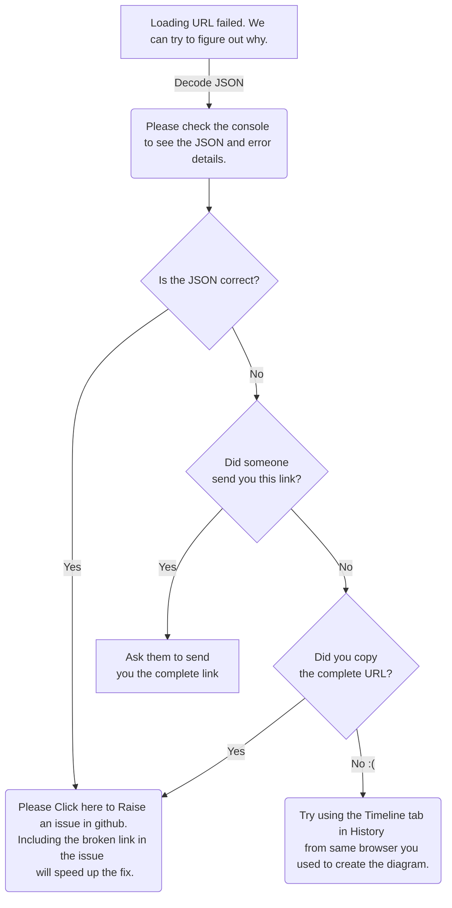

```mermaid
flowchart TD
    A[Loading URL failed. We can try to figure out why.] -->|Decode JSON| B(Please check the console to see the JSON and error details.)
    B --> C{Is the JSON correct?}
    C -->|Yes| D(Please Click here to Raise an issue in github.<br/>Including the broken link in the issue <br/> will speed up the fix.)
    C -->|No| E{Did someone <br/>send you this link?}
    E -->|Yes| F[Ask them to send <br/>you the complete link]
    E -->|No| G{Did you copy <br/> the complete URL?}
    G --> |Yes| D
    G --> |"No :("| H(Try using the Timeline tab in History <br/>from same browser you used to create the diagram.)
```
